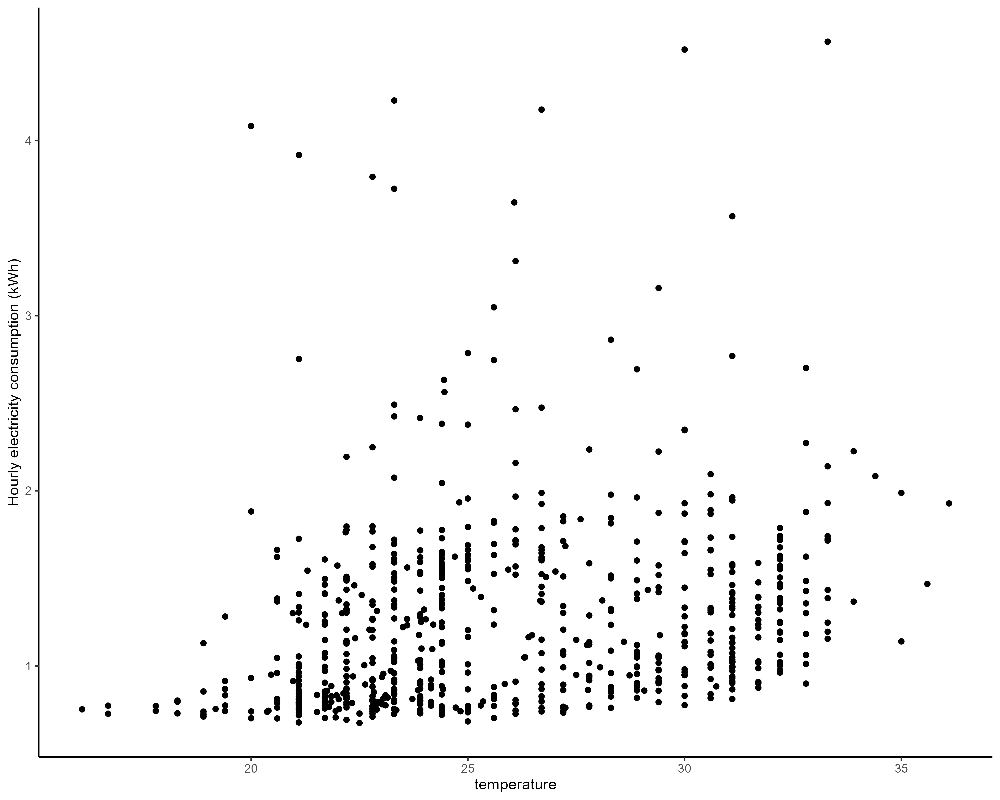

```{r setup, include=FALSE}
knitr::opts_chunk$set(echo = TRUE)
```

```{r echo=FALSE, include=FALSE}
rm(list = ls())


##carga paquetes

PAQUETES <- c("dplyr","tidyverse","ggplot2","here","arrow","lubridate","readxl","formatR","plm","stargazer","knitr","caret")

for (el in PAQUETES){
  if (!require(el, character.only = TRUE)) {
    install.packages(el, repos = "https://cloud.r-project.org")
    require(el, character.only = TRUE)
  }
}

rm(PAQUETES, el)

path<-here()
setwd(path)
```

# 1. introduction

The challenge of managing and predicting energy consumption is critical. This report presents a comprehensive analysis where the primary objective is to understand and forecast the impact of rising temperatures on electricity demand, particularly during the peak month of July. The focus is on preempting potential energy shortages and blackouts that could arise from an overburdened electrical grid during an unusually hot summer.

We have employed a multi-faceted approach to address this challenge, leveraging a rich dataset encompassing static house data, detailed hour-by-hour energy usage, and corresponding weather data. Through meticulous data preparation, exploratory analysis, and advanced modeling techniques, we aim to unveil the key drivers of energy consumption. This understanding will enable us to propose data-driven strategies not only to predict future energy demand under heightened temperature scenarios but also to explore avenues for energy conservation.

# 2. Data reading and merging approach


In the data preparation phase, we focus on consolidating and preparing three key datasets for our analysis of household energy consumption. These datasets include house static data, electricity consumption data, and weather data.

### House Static Data Loading

We begin by loading the static information about the houses. This dataset, obtained in Parquet format, contains essential identifiers such as building IDs (`bldg_id`) and county information. These identifiers are crucial as they link the static house data with the dynamic electricity consumption and weather data.

```{r eval=FALSE, tidy=TRUE}
url<-"https://intro-datascience.s3.us-east-2.amazonaws.com/SC-data/static_house_info.parquet"
house_static_data <- read_parquet(url)

#store the ids to load the energy consumption data
ids <- house_static_data %>% pull(bldg_id)

#store the counties to load the weather data
counties <- house_static_data %>% pull(in.county) %>% unique()
```

### Electricity Consumption Pipeline

The electricity consumption data is processed in a pipeline designed to handle data for each building individually. This involves iterating over each building ID, fetching electricity consumption data from corresponding Parquet files. The pipeline includes error handling to manage potential issues in data loading. For each building, we calculate the total electricity consumption and retain essential timestamps. This structured approach ensures efficient handling and processing of large-scale data, preparing it for further analytical steps.

```{r eval=FALSE, tidy=TRUE}
# Initialize a counter for tracking progress in the loop
ii <- 1

# Initialize an empty tibble for storing electricity consumption data
electricity_consumption <- tibble(total_electricity = numeric(), date = Date())

# Loop through each building ID to process electricity consumption data
for (id in ids) {
  # Attempt to read the electricity data for the current building ID
  response <- try(read_parquet(
    paste0("https://intro-datascience.s3.us-east-2.amazonaws.com/SC-data/2023-houseData/",
           id,
           ".parquet")))
  
  # Print the counter to track progress
  print(ii)
  
  # Handle errors in data loading
  if (class(response)[1] == "try-error") {
    print(paste0("error loading house ", id))
  } else {
    # Process the electricity data
    response %>%
      mutate(total_electricity = rowSums(select(., contains("electricity")), na.rm = TRUE)) %>%
      select(total_electricity, time) %>%
      mutate(bldg_id = id) -> temp_data
    
    # Append the processed data to the main electricity consumption tibble
    electricity_consumption <- rbind(electricity_consumption, temp_data)
    
    # Clear the temporary data to free up memory
    rm(temp_data)
    
    # Increment the counter
    ii <- ii + 1
  }
}
```


### Weather Data Pipeline

Parallel to processing electricity data, we also manage weather data, specifically focusing on temperature metrics across different counties. The weather data, sourced in CSV format, includes detailed temperature readings. We process this data by iterating over each county, aligning the weather data with our other datasets based on the county identifier. This step is crucial for analyzing the impact of weather on electricity consumption patterns.

```{r eval=FALSE}
# Initialize an empty tibble for storing temperature data
temperature <- tibble(max_temp = numeric(), min_temp = numeric(), avg_temp = numeric(), date = Date())

# Loop through each county to process weather data
for (county in counties) {
  # Read the weather data CSV for the current county
  response <- read_csv(
    paste0(
      "https://intro-datascience.s3.us-east-2.amazonaws.com/SC-data/weather/2023-weather-data/",
      county, 
      ".csv"))

  # Process the weather data
  response %>%
    select(date_time, contains("Temperature")) %>% 
    rename(temperature = `Dry Bulb Temperature [°C]`) %>%
    filter(date_time >= as.Date("2018-07-01"), date_time <= as.Date("2018-07-31")) %>%
    # Additional processing can be done here such as summarizing daily temperatures
    mutate(county_id = county) -> temp_data
  
  # Append the processed data to the main temperature tibble
  temperature <- rbind(temperature, temp_data)

  # Clear the temporary data to free up memory
  rm(temp_data)
}

# Save the processed temperature data to a CSV file
write_csv(temperature, paste0("~/GitHub/household_energy_consumption/data/temperature.csv"))
```

### Data Merging and Final Output

The final step in the data preparation phase is to merge these processed datasets. This involves aligning the electricity consumption data with the static house data and weather data, creating a comprehensive dataset that forms the backbone of our subsequent analysis. The output of this phase is a clean, well-structured dataset that encapsulates all necessary variables, ready for in-depth analysis.

# 3. Exploratory Analysis

In this phase, we commenced with a strategic preselection of features from the household static data. Our selection criteria were primarily guided by domain expertise, focusing on features directly related to energy consumption. The detailed list of these selected features can be found in [Annex 1](#annex1).

Upon examination, both the temperature data and the household static data were found to be complete with no missing entries, ensuring robustness in the subsequent analysis.

An initial observation from our exploratory analysis indicates a positive correlation between energy consumption and temperature. This trend is evident at both the individual house and county levels, suggesting a consistent pattern across different scales of data. The following visualization illustrates this correlation:

```{r house-plot, fig.cap="Electricity consumption at individual household level", out.width='70%', echo=FALSE}

```

```{r county-plot, fig.cap="Electricity consumption at county level", out.width='70%',echo=FALSE}

```


## Feature importance

To assess the importance of each house feature in energy consumption, we merged the static and dynamic data, selecting a sample of 5% of the rows to run a random forest model. This approach helped us determine the importance of each feature in explaining electricity consumption. The most significant features identified are hour, the floor area and the vacancy status. For further analysis, we only selected features with an importance higher than 0.95%.


## Feature engineering

Once the most important features were identified, we proceeded to refine the static house data. This process involved converting some categorical variables into numeric ones, such as insulation quality, HVAC efficiency, and window area. Other features were divided into multiple categories, especially those with composite information in their string values, like the "windows" feature. In some cases, the number of possible values for a factor was reduced, and ordinal factors, such as "usage_level," were converted to numeric. This extensive feature engineering required the use of regular expressions to extract information from strings.


```{r eval=FALSE}
house_data %>% 
  select(-in.geometry_floor_area) %>%  # in sqft
  mutate(
    clothes_drier_type = str_extract(in.clothes_dryer, "^[^,]*"), #type of clothes dryer
    clothes_dryer_usage = str_extract(in.clothes_dryer, "(?<=\\s).+?(?=%)"), #usage of clothes dryer
    clothes_dryer_usage= as.numeric(clothes_dryer_usage), #to numeric
    clothes_dryer_usage = replace_na(clothes_dryer_usage,0)
    ) %>% #nas are 0
  select(-in.clothes_dryer) %>%  #drop in.clothes drier
  mutate(infiltration_ACH50 = as.numeric(str_extract(in.infiltration, "^[^ ]*"))) %>% #is a number in reality
  select(-in.infiltration) %>% 
  left_join(income_dictionary,by="in.income") %>% 
  select(-in.income) %>% 
  mutate(
    in.occupants=as.numeric(in.occupants),
    ) %>% 
  mutate(
    in.plug_load_diversity=as.numeric(str_extract(in.plug_load_diversity, "^[^%]*")),
    duct_leakage=as.numeric(str_extract(in.ducts, "^[^%]*")),
    duct_leakage=replace_na(duct_leakage,0),
    duct_insulation_quality = as.numeric(str_extract(in.ducts, "(?<=-).*")),
    duct_insulation_quality=replace_na(duct_insulation_quality,0),
  ) %>% 
  select(-in.ducts) %>% 
  mutate(
    wall_material = str_extract(in.insulation_wall, "^[^,]+"),
    wall_insulation_quality = replace_na(as.numeric(str_extract(in.insulation_wall, "(?<=R-)\\d+")), 0)
  ) %>% 
  select(-in.insulation_wall) %>% 
  mutate(
    in.vintage=as.numeric(
        case_when(
          in.vintage=="<1940" ~ "1940",
          T ~ substr(in.vintage,1,4))
        )
  ) %>% 
  separate(in.windows, into = c("winPane", "winGlazing", "winFrame", "winFill", "winAdditional"), sep = ", ", fill = "right") %>%
  mutate(
    winPane = replace_na(winPane, "None"),
    winGlazing = replace_na(winGlazing, "None"),
    winFrame = replace_na(winFrame, "None"),
    winFill = replace_na(winFill, "None"),
    winAdditional = replace_na(winAdditional, "None")
  ) %>%
  mutate(
    winPane = factor(winPane),
    winGlazing = factor(winGlazing),
    winFrame = factor(winFrame),
    winFill = factor(winFill),
    winAdditional = factor(winAdditional)
  ) %>% 
  mutate(in.cooling_setpoint=as.numeric(substr(in.cooling_setpoint,1,2))) %>% 
  mutate(
    HVAC_type = case_when(
      str_detect(in.hvac_cooling_efficiency, "AC,") ~ "AC",
      str_detect(in.hvac_cooling_efficiency, "Heat Pump") ~ "Heat Pump",
      str_detect(in.hvac_cooling_efficiency, "Room AC,") ~ "Room AC",
      TRUE ~ "None"  # Default case if none of the above matches
    ),
    HVAC_efficiency = as.numeric(str_extract(in.hvac_cooling_efficiency, "\\d+\\.?\\d*"))  # Extracts numbers, including decimals if present
  ) %>%
  # Replace NAs with zeros in efficiency if no number is found
  mutate(
    HVAC_efficiency = replace_na(HVAC_efficiency, 0)
  ) %>% 
  select(-in.hvac_cooling_efficiency) %>% 
  mutate(
    in.geometry_garage = as.numeric(substr(in.geometry_garage, 1, 1)),
    in.geometry_garage = replace_na(in.geometry_garage, 0)
    ) %>% 
  select(-in.city) %>% #most are "other"
  mutate(
    in.window_areas = 4*as.numeric(str_extract(in.window_areas, "\\d+"))
  ) %>% 
  select(-in.federal_poverty_level) %>%  #colinear with income
  mutate(
    in.insulation_ceiling = case_when(
      in.insulation_ceiling == "Uninsulated" ~ 0,  # Assuming uninsulated means R-0
      in.insulation_ceiling == "None" ~ 0,         # Assuming none means R-0
      TRUE ~ as.numeric(str_extract(in.insulation_ceiling, "\\d+"))
    )
  ) %>% 
    mutate(
    in.pv_system_size = case_when(
      in.pv_system_size == "None" ~ 0,  # Assign 0 to 'None'
      TRUE ~ as.numeric(str_extract(in.pv_system_size, "\\d+\\.?\\d*"))  # Extract numeric kW value
    )
  ) %>% 
  select(-in.has_pv) %>%  # in pv_system_size
  mutate(
    cooling_Day_Adjustment = as.integer(grepl("Day", in.cooling_setpoint_offset_period)),
    cooling_Night_Adjustment = as.integer(grepl("Night", in.cooling_setpoint_offset_period)),
    cooling_Hour_Offset = as.numeric(str_extract(in.cooling_setpoint_offset_period, "[-+]?\\d+"))
  ) %>%
  # Replace NAs with zeros if no offset is specified
  mutate(
    cooling_Hour_Offset = replace_na(cooling_Hour_Offset, 0)
  ) %>% 
  select(-in.cooling_setpoint_offset_period) %>% 
  mutate(
    wall_material = case_when(
      str_detect(in.geometry_wall_exterior_finish, "Wood") ~ "Wood",
      str_detect(in.geometry_wall_exterior_finish, "Aluminum") ~ "Aluminum",
      str_detect(in.geometry_wall_exterior_finish, "Vinyl") ~ "Vinyl",
      str_detect(in.geometry_wall_exterior_finish, "Brick") ~ "Brick",
      str_detect(in.geometry_wall_exterior_finish, "Stucco") ~ "Stucco",
      str_detect(in.geometry_wall_exterior_finish, "Fiber-Cement") ~ "Fiber-Cement",
      str_detect(in.geometry_wall_exterior_finish, "Shingle") ~ "Shingle",
      in.geometry_wall_exterior_finish == "None" ~ "None",
      TRUE ~ "Other"
    ),
    wall_color_lightness = case_when(
      str_detect(in.geometry_wall_exterior_finish, "Light") ~ "Light",
      str_detect(in.geometry_wall_exterior_finish, "Medium") ~ "Medium",
      str_detect(in.geometry_wall_exterior_finish, "Dark") ~ "Dark",
      TRUE ~ "None"
    )
  ) %>% 
  select(-in.geometry_wall_exterior_finish) %>% 
  mutate(
    in.ceiling_fan = as.integer(in.ceiling_fan == "Standard Efficiency")  # 1 if in use, 0 otherwise
  ) %>% 
  mutate(
    in.usage_level = case_when(
      in.usage_level == "Low" ~ 1,
      in.usage_level == "Medium" ~ 2,
      in.usage_level == "High" ~ 3,
      TRUE ~ NA_real_  # for any cases that might not match the above, resulting in an NA
    )
  ) -> encoded_house_data
```

With the engineered features, we replicate the previous random forest to get more precise insights on the feature importance. The most important features remain the same. The ACH50 insulation is the only category in wich changes can be made to affect electricity consumption, as most other important features are inmutabe (such as floor area or number of rooms).


# 4. Building a Model for Prediction

```{r echo=FALSE, include=FALSE}
#load data for prediction
house_static_data <- read_parquet("https://intro-datascience.s3.us-east-2.amazonaws.com/SC-data/static_house_info.parquet") %>% 
  select(bldg_id,in.county) %>% 
  rename(county_id=in.county)
temperature <-read_csv("~/GitHub/household_energy_consumption/data/temperature.csv") %>% 
  rename(time=date_time)
data <-read_csv("C:/Users/franc/OneDrive/MADS/IST687/final_project/electricity_consumption.csv") %>%
  # sample_frac(.20) %>% 
  left_join(house_static_data,by="bldg_id") %>% 
  left_join(temperature,by=c("county_id","time")) %>% #join with encoded data
  group_by(county_id,time) %>% 
  summarise(
    total_electricity=sum(total_electricity),
    temperature = mean(temperature)
  ) %>% 
  mutate(total_electricity=log(total_electricity)) #log transformation so the betas are interpreted as percentage increase/decrease
```

The assignment consisted of predicting hourly energy consumption for each county in the month of July, assuming a temperature increase of 5 degrees Celsius. 

## Data Preprocessing and Initial Approach

As a preprocessing step, the energy consumption data was transformed using logarithms. This adjustment is particularly relevant given that our initial plots suggest an exponential relationship between energy consumption and temperature. By applying a logarithmic transformation, we not only facilitate a linear interpretation of this relationship but also allow the model's coefficients (betas) to be interpreted in terms of percentage change. Specifically, this transformation enables us to quantify the percentage increase in energy consumption corresponding to a one-unit change in each explanatory variable, thereby linearizing the originally exponential relationship for more effective analysis.

The initial concept involved developing a bottom-up model that incorporated key household features identified as significant influencers of energy consumption, with the aim of predicting individual household electricity consumption on an hourly basis. However, this approach was set aside due to computational constraints. Implementing such a model would have necessitated replicating each house's features 744 times to account for the data across 24 hours a day and 31 days, which proved to be impractical with the available computational resources. Consequently, we shifted our focus to an aggregated model that analyzes energy consumption at the county level, which offered a more feasible and computationally manageable approach.

## Panel Data Regression with Fixed Effects

This subsequent approach treated this problem as a panel data regression with fixed effects, considering counties as the cross-sectional variable and the hour as the time variable. However, this approach yielded an R-squared of 0.13, resulting in an ineffective model.

```{r echo=FALSE,results='asis'}
panel_data <- pdata.frame(data, index = c("county_id", "time"))

#run a fixed effects model
panel_model <- plm(total_electricity ~ temperature, 
                data = panel_data, 
                model = "within")
stargazer(panel_model, type = "latex", header = TRUE, title = "Regression Summary of Panel Model with Fixed Effects")


```
## Linear Regression Model

The next approach involved modeling a linear regression, where we extracted the hour and the day of the week as independent features. The regression model is as follows:

\( y = a + bX + e \)

where \( y \) represents the electricity consumption, and \( X \) includes the temperature,the county, the hour, and the day of the week. Notably, 'county', 'hour', and 'day of the week' are treated as categorical variables. The regression model is structured to provide insights into the impact of these variables on electricity consumption.Upon running the linear regression, we derived key summary statistics, which are presented in the table below:

```{r echo=FALSE}

data %>% 
  mutate(day = factor(day(time))) %>% 
  mutate(day_of_week = factor(as.numeric(wday(time, label = TRUE)))) %>% #start in sunday
  filter(!is.na(temperature)) %>%  #drop the counties where I do not have the temperature
  mutate(hour=factor(hour(time))) %>% 
  select(-day) %>% #colinear with day of the week
  select(-time)-> data_times

lm_model_dates <- lm(total_electricity~.,data=data_times)

# Extract key model summary statistics
model_summary <- summary(lm_model_dates)
summary_stats <- data.frame(
  Residual.Standard.Error = model_summary$sigma,
  R.Squared = model_summary$r.squared,
  Adjusted.R.Squared = model_summary$adj.r.squared,
  F.Statistic = model_summary$fstatistic[1],
  DF1 = model_summary$fstatistic[2],
  DF2 = model_summary$fstatistic[3],
  P.Value = pf(model_summary$fstatistic[1], model_summary$fstatistic[2], model_summary$fstatistic[3], lower.tail = FALSE)
)

# Use knitr::kable() to create a summary table
kable(summary_stats, caption = "Summary Statistics of Linear Model")


```

The output of the regression model indicates a strong fit, as evidenced by the significance of all coefficients for each iteration of the categorical variables, and an adjusted R-squared value of 0.99[^1]. This high R-squared value suggests that the model explains a substantial portion of the variance in electricity consumption based on the selected variables.

[^1]: It is important to note that, given the time series nature of this problem with prominent daily and weekly seasonality, the most influential predictors for electricity consumption in each county are identified as the day of the week and the hour. These time-related variables capture the cyclic patterns of energy usage, making them crucial for understanding and predicting consumption trends.

## Model Evaluation and Comparison

To compare the predictive capability with other models, we conducted a train-test split of 80%-20% and computed performance metrics from 10-fold cross-validation:
```{r echo=FALSE, include=FALSE}
set.seed(123)  # for reproducibility
trainIndex <- createDataPartition(data_times$total_electricity, p = .8, 
                                  list = FALSE, 
                                  times = 1)

dataTrain <- data_times[ trainIndex,]
dataTest  <- data_times[-trainIndex,]

train_control <- trainControl(method = "cv", number = 10)

```

```{r echo=FALSE}
lm_model <- readRDS("C:/Users/franc/OneDrive/MADS/IST687/final_project/lm_model.rds")

# Make predictions on the test set
predictions <- predict(lm_model, newdata = dataTest)

# Calculate performance metrics on the test set
test_metrics <- postResample(pred = predictions, obs = dataTest$total_electricity)

# Convert the metrics to a data frame for better formatting
test_metrics_df <- data.frame(
  Value = test_metrics
)

# Use knitr::kable() to create a formatted table
kable(test_metrics_df, caption = "Performance Metrics on Test Set")

```
The metrics suggest that the model performs well. Considering an average hourly energy consumption of 4.4 kWh, the Root Mean Squared Error (RMSE) corresponds to an average error of approximately 2.3%. This relatively low error percentage indicates a high level of accuracy in the model's predictions.


## Considering Non-linearities in Temperature

Nevertheless, we postulated that there might be non-linearities associated with temperature changes, as air conditioners, for instance, switch off below a certain temperature and on above a certain threshold. Consequently, we retried the regression with a quadratic term for temperature. The results were as follows:

```{r echo=FALSE}
sq_lm_model <- readRDS("C:/Users/franc/OneDrive/MADS/IST687/final_project/sq_lm_model.rds")

dataTest <- dataTest %>% 
  mutate(sqr_temperature=temperature^2)

# Make predictions on the test set
predictions <- predict(sq_lm_model, newdata = dataTest)

# Calculate performance metrics on the test set
test_metrics <- postResample(pred = predictions, obs = dataTest$total_electricity)

# Convert the metrics to a data frame for better formatting
test_metrics_df <- data.frame(
  Value = test_metrics
)

# Use knitr::kable() to create a formatted table
kable(test_metrics_df, caption = "Performance Metrics on Test Set for non linearities in Temperature")

```

The differences in performance are minimal and does not justify the increased complexity of the model.

## Assessment of Tree-Based Methods

Another potential approach is using a tree-based method, such as random forest regression. However, we do not prefer this method for our task, which involves extrapolation. Regression trees inherently struggle with extrapolation. They are non-parametric and local in nature, meaning they make predictions based on the structure discovered within the data they have been trained on. Consequently, a regression tree can only make predictions within the confines of the training data's range.


# 5. Forecast of future energy demand 

Our analysis projects an average increase in electricity demand of 12.5% when temperatures rise by 5 degrees Celsius across the board. This projection underscores the significant impact of temperature on energy consumption patterns.

The day-of-the-week analysis reveals a more nuanced picture. The increase in demand is expected to be more pronounced on Saturdays and Fridays, likely due to heightened activities and occupancy during these days. In contrast, the smallest increase is anticipated on Wednesdays, which might be attributed to more stable routines and possibly lower occupancy or activity levels midweek.
By day of the week, the increase would be higher on saturday and friday and lower on wednesday. 


The hourly analysis provides further insights. The peak increase in electricity demand is projected around 18:00 hours (6 PM), coinciding with the typical return of occupants to their homes and the consequent rise in the usage of electrical appliances and air conditioning systems. Conversely, the lowest increase is expected around 10:00 in the morning, a period generally characterized by lower occupancy and reduced electrical usage in residential settings.


# 6. Approaches to reduce energy demand

Reducing electricity demand presents challenges, particularly because it often hinges on immutable characteristics such as floor area, room count, and vacancy status. Nonetheless, certain improvements can offer marginal gains in energy efficiency. For instance, enhancing ACH50 infiltration or wall insulation can make a notable difference.

However, the most impactful strategy for reducing electricity consumption may lie in altering household consumption patterns. Practical measures might include reducing air conditioning usage or adjusting the set temperature. Yet, influencing consumer behavior poses significant challenges from a policy standpoint. It demands a justification for why such behavioral changes are preferable to augmenting production capacity. From our perspective, expanding production capacity, especially with the decreasing costs of renewable energy installations, appears less burdensome than enforcing specific consumption patterns.

A critical caveat in our analysis is the exclusion of electricity prices. Our assessment assumes constant demand, which does not reflect the reality of fluctuating electricity prices, especially in scenarios where no new capacity is installed. As electricity becomes costlier, consumers may need to adjust their usage to manage expenses. Notably, air conditioning—one of the most price-sensitive forms of electricity consumption—may see reduced usage in response to higher prices. Additionally, increased electricity prices could make household photovoltaic production more financially viable. It is important to note that peak hours for photovoltaic production often coincide with higher temperatures, thus aligning with increased air conditioning use.

A second caveat, stems from the assumption of treating counties and, by extension, the dwellings within them as static entities. This oversimplification overlooks the endogenous relationship between rising temperatures and consumer behavior. As temperatures climb, it's plausible for inhabitants to adapt by increasing the installation of air conditioners, ventilation systems, and other cooling appliances. This behavioral adaptation can significantly alter electricity consumption patterns, rendering our current analysis, which does not account for these dynamic changes, potentially less relevant or accurate. 

In conclusion, electricity prices are crucial signals of market scarcity. Allowing these prices to provide clear signals is essential. Consequently, reforms aimed at reducing inefficiencies, liberalizing markets, and minimizing administrative and regulatory barriers are critical for the efficient functioning of the electricity market. In a scenario where the market is liberalized and prices accurately reflect demand and supply, higher prices could naturally drive new consumption patterns while encouraging increased production from both households and energy providers.

# 7. Conclusion

In this technical report, our comprehensive analysis of energy consumption data has yielded several critical insights. The analysis focused on understanding the drivers of electricity demand, particularly in the face of potential temperature increases during the peak month of July.

One of the primary findings is that the major determinants of energy usage are fixed features of residential properties, such as floor area and room count. These immutable characteristics underscore a fundamental challenge in managing energy consumption solely through behavior modification strategies. Given this context, our recommendation leans towards expanding energy production capacity as a more viable and immediate solution to meeting increased energy demand. This approach aligns with the need for a robust and reliable energy supply, particularly during peak usage periods.

Furthermore, the analysis highlighted the necessity of incorporating electricity pricing into the predictive models. The inclusion of price data would provide a more realistic and nuanced understanding of consumer behavior and energy consumption patterns. Price elasticity plays a crucial role in shaping consumer behavior, particularly in response to peak demand and pricing. Therefore, a pricing strategy could be an effective tool in managing demand, alongside other approaches.

In conclusion, while consumer behavior plays a role in energy consumption, the predominant influence of fixed house attributes suggests that increasing production capacity is a pragmatic approach to address the challenges of higher energy demand. However, a comprehensive strategy that also considers dynamic pricing mechanisms would offer a more balanced and effective way to manage energy consumption patterns in the face of rising temperatures.


# Annex 1 {#annex1}

List of preselected features using domain expertise:

```{r echo=FALSE}
selected_features <- read_excel(paste0(path,"/data/data_dictionary.xlsx"), sheet=3) %>% pull()
knitr::kable(data.frame(Feature = selected_features))
```

# Annex 2 {#annex2}

Contributions of each team member:

- **Francisco Franco Arenas:**
  - Design, coding, and execution of the pipeline to load and merge the data.
  - Data exploratory analysis.
  - Feature engineering and feature importance analysis.
  - Development of prediction models.
  - Elaboration of the final report.
- **Ayush Thoniparambil Saseendran:**
  - Data transformation
  - Development and publication of shiny App
- **Collin Joseph Kneiss:**
  - Collaboration of Project Design
  - Development of Presentation
  - Elaboration of Project to Company
- **Prakruti Pruthvi Kumar:**
  - Elaboration of presentation
  - Development of shiny app
  